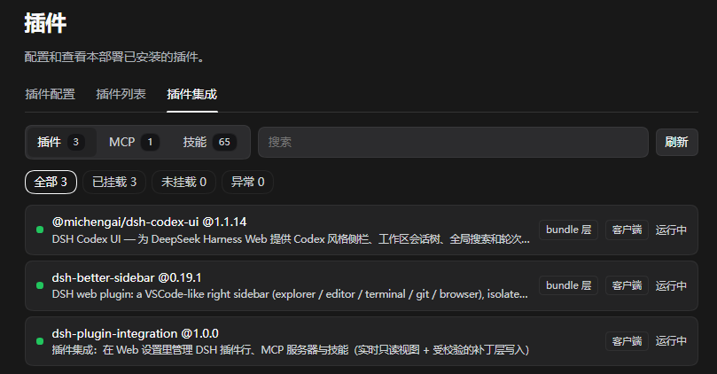
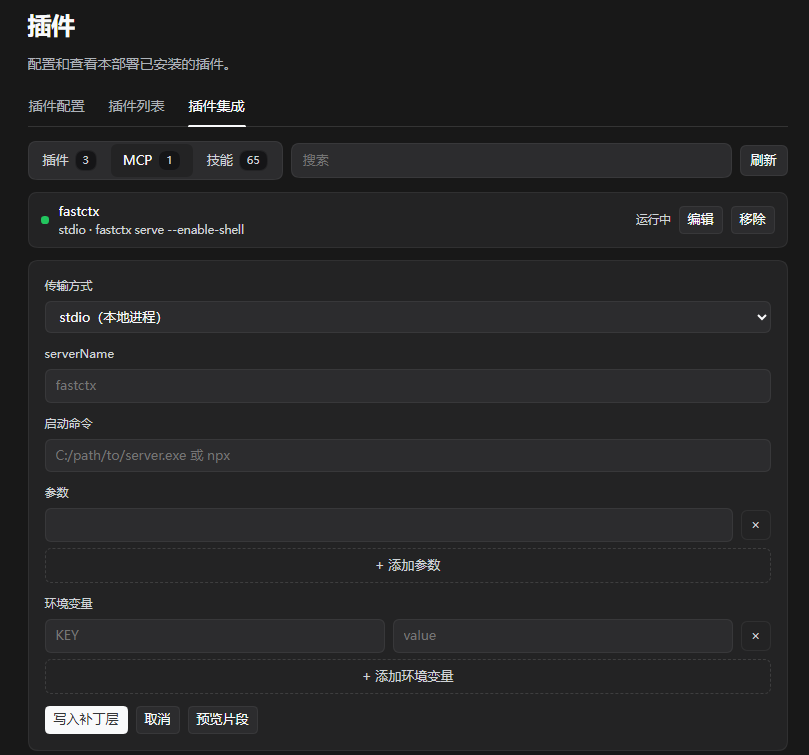
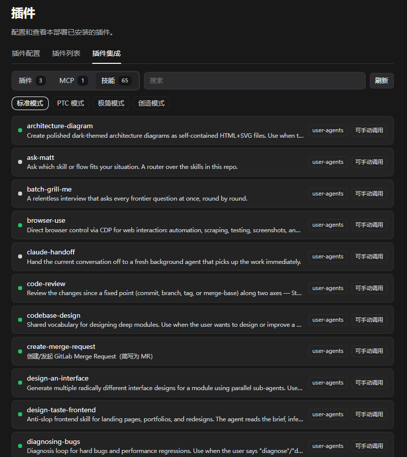

# dsh-plugin-integration（插件集成）

**简体中文** · [English](README.md)

在 DSH Web 的 **设置 → 插件 → 插件集成** 里管理一个 profile 的三件事：**插件**、**MCP 服务器**、**技能**。

这是一个**常驻**插件（随 `dsh web` 启动加载的普通包），不是内存态的 Cordis 实验包：重启之后它还在。

## 截图

**插件** —— profile 已安装的全部依赖，含版本、`dsh` 声明与各行相位；卸载走官方 CLI。



**MCP** —— 上方是已挂载的服务器，下方是增改表单；条目会先校验，再把即将写入的 `cordis.patch.yml` 原文预览出来。



**技能** —— 某个 Agent 预设视角看到的技能目录，含来源、是否可手动调用与正文。



## 能做什么

| 标签页 | 读 | 写 |
|---|---|---|
| **插件** | profile 已安装的全部依赖 —— 与 `dsh plugin --profile <name> list` 同一口径 —— 含版本、是否声明 `dsh.bundle` / 客户端半包、匹配到的 Loader 行及各行相位（`pending` / `loading` / `active` / `failed` / `unloading`） | **卸载**：走官方通道 `dsh plugin --profile <name> remove <pkg>`，依赖、锁文件、`dsh.profile.bundles` 三处一起变 |
| **MCP** | 已挂载的每一条 `mcp-client` 行（宿主平面与预设平面），含传输方式与目标 | **增 / 改 / 删**：先校验，再把即将写入的 `cordis.patch.yml` 文本原样预览，最后写入 |
| **技能** | 指定 Agent 预设视角看到的技能目录，含来源与技能正文 | 设计上只读 |

另有一个模型可见的工具 `plugin_integration_status`，不打开页面也能回答"装了什么 / 某个插件为什么没挂上"。

## 环境要求

- 带 `web` profile 的 DSH（`dsh web`）。
- Node.js ≥ 20。
- 仅"卸载"按钮需要 `dsh` 在 `PATH` 上；其余功能不需要（见 [`dshCommand`](#配置)）。

## 安装

```bash
# 直接从 GitHub 安装
dsh plugin --profile web add github:quietseek/dsh-plugin-integration
```

然后**重启 `dsh web`**。bundle 层是启动时组合的，首次安装只刷新页面不够。之后打开
**设置 → 插件 → 插件集成**。

安装就是这一条命令：包里声明了 `dsh.bundle.patch`，CLI 会把它追加进 `dsh.profile.bundles`，
profile 启动时合并它自带的补丁层，**不需要手改任何 profile 文件**。

### 之前是手动挂载的？

先删掉 profile 自己 `cordis.patch.yml` 里那条
`file:///…/dsh-plugin-integration/lib/index.js?v=N`，**再**安装 bundle。两条同时启用会各自注册
`/plugin-integration/api`，而 webserver 对重复 exact 路由是直接拒绝的 —— 会导致**整棵插件树启动失败**。
bundle 补丁里带了兜底守卫，插件本身现在也会跳过自己的注册并打一条 warning 而不是抛错，
但那条多余的挂载行仍然应该删掉。

### 不用 CLI（离线 / 开发）

```bash
git clone https://github.com/quietseek/dsh-plugin-integration ~/dsh-plugin-integration
dsh plugin --profile web add file:$HOME/dsh-plugin-integration
```

`file:` / `link:` 规格同样有效：真正决定它进 `dsh.profile.bundles` 的是 bundle 声明。

## 配置

在 profile 自己的 `cordis.patch.yml` 里加一条**同 id** 的行（它在所有 bundle 层之后应用，因此覆盖内置行）：

```yaml
- id: plugin-integration
  config:
    profileDir: /home/you/.dsh/profiles/web   # 默认：自动探测
    dshCommand: /usr/local/bin/dsh            # 默认：PATH 上的 dsh
    allowRemote: false                        # 默认：仅回环
```

| 键 | 默认 | 含义 |
|---|---|---|
| `profileDir` | 自动探测 | 本页可写的 profile。探测顺序是 `ctx.baseUrl` → 包自身位置，且**每个候选都会做 profile 校验**后才采信。日志里出现"未能定位 profile 目录"时就显式设置它。 |
| `dshCommand` | `dsh` | `dsh plugin --profile <name> …` 使用的可执行文件。`dsh` 不在 `PATH` 上时（wheel 运行时、本地安装、绝对路径）设置它。 |
| `allowRemote` | `false` | 解除"仅回环"限制。用之前先读下面的警告。 |

## 安全设计

这个页面会读写你的 Harness 配置，所以边界收得很紧：

- **仅回环**：除非设了 `allowRemote: true`，请求必须来自回环对端，**且**载体不能绑定在 `0.0.0.0`。
  这一点是必要的：DSH 的浏览器载体**自身没有鉴权**（`webServer.host` 可以配成 `0.0.0.0`），
  而 `Sec-Fetch-Site` 头在非浏览器客户端上根本不存在 —— 只检查同源等于放行 `curl`。
  另外 `GET …?action=mcp-detail` 会明文返回环境变量与请求头的**值**（编辑表单需要），
  `POST …plugin-uninstall` 会调用包管理器。
- **同源**：在此之上再加同源校验（同机浏览器对回环地址同样成立，所以两者都需要）。
- **写入是外科手术式的**：补丁层保留注释与既有内容；即将发布的文本会被**再解析一次**，
  条目数必须正好 +1 才落盘；落盘前留一份 `.bak`，并用临时文件 + rename 原子替换。
- **只认本插件写过的条目**：每条托管条目带 `# 插件集成 managed mcp server: <name>` 标记，
  手写的行在页面上永远是只读的，绝不改动。
- **不渲染密钥**：列表视图里 `headers` / `env` 只显示键名。
- **拒绝卸载自己**，也拒绝任何不是本 profile 依赖的名字。

如果你把 Harness 端口暴露到回环之外，请自行在前面加鉴权，并把本页当作特权管理界面。

## HTTP 契约

单一路由，JSON，仅回环。生成的条目用 `serverName` 作为 Loader `id`。

| 方法 | `action` | 说明 |
|---|---|---|
| GET | `snapshot` | 页面全量状态：插件行 + 计数、各预设组成、MCP 列表、指定预设视角的技能目录、补丁层文本、客户端包注册自检 |
| GET | `skills` | 某个预设视角的技能目录（`preset=<id>`） |
| GET | `skill` | 单个技能正文（`preset`、`name`） |
| GET | `mcp-snippet` | 生成 `cordis.patch.yml` 片段（`arg`、`envName`/`envValue`、`headerName`/`headerValue` 可重复） |
| GET | `mcp-detail` | 一台已挂载 MCP 服务器的完整配置（含**值**），用于回填编辑表单 |
| POST | `mcp-apply` | 校验后把片段写入补丁层 |
| POST | `mcp-replace` | 编辑本页写入过的条目（`original` 指明原名，允许改名） |
| POST | `mcp-remove` | 移除本页写入的条目 |
| POST | `plugin-uninstall` | `{"name": "..."}`；带 `"dryRun": true` 时只自检 CLI 通道 |

## 本地开发

```yaml
# profile 自己的 cordis.patch.yml —— 手写挂载，仅开发用
- insert:
    - id: plugin-integration
      name: 'file:///abs/path/to/dsh-plugin-integration/lib/index.js?v=1'
```

- **只改 `lib/client.js`**：刷新浏览器页面即可（客户端扫描会按文件内容重算 rev）。
- **改了 `lib/index.js`**：把 `?v=N` 数字 +1（Node ESM 按完整 URL 缓存，查询串变化 = 新模块），
  或者重启 `dsh web`。

`npm test` 跑的是打包契约（客户端模块 id 与包名一致、bundle 声明、exports、依赖声明齐全、
无构建步骤）；`npm run check` 对两个半包做语法检查。

## 常见问题

**标签页不出现。** 客户端包是按**包名**注册的。看页面诊断里的
`客户端包 … 未注册到页面图`，并确认没有"改了包名却没改 `lib/client.js` 里的 `id`" ——
`npm test` 会断言两者一致。

**提示"未能定位 profile 目录" / 拒绝写入。** 自动探测没找到像 profile 的目录，显式设置
`config.profileDir`。这个闸门存在的原因是：早期的"从包位置往上一级"猜测在 scoped 安装下会往
`node_modules/`、在共享回退目录下会往 `$DSH_HOME/profiles/` 静默写入一个 `cordis.patch.yml`，
而不是报错。

**启动失败并报 "duplicate exact route"。** 有两条行挂载了本插件，删掉手写的那条
（见[之前是手动挂载的？](#之前是手动挂载的)）。

**卸载按钮报 spawn 失败。** `dsh` 不在 `PATH` 上，设置 `config.dshCommand`。

**卸载了 bundle 型插件但好像还在。** bundle 层是启动时组合的，重启 `dsh web`；页面会提示这一点并回显 CLI 输出。

## 已知边界

- 仅支持 web profile（`dsh.client.platform: "web"`，且宿主半包需要 `webServer`）。
- 只管理补丁层；不从页面改写 `dsh.profile.bundles`（那是启动期的事，归 CLI 管）。
- 技能是只读视图（目录 + 正文，不提供增删）。
- 界面目前只有中文。

### 做多语言

`lib/client.js` 里所有面向用户的字符串都集中在少数几个字面量（`PHASE_TEXT`、标签页名、按钮与分区标题）。
DSH 自带的 `@deepseek-ai/dsh-client-locale` 就是为此准备的：把它加进 `dsh.client.inject`
再把这些字面量换成 `t(...)` 即可。欢迎 PR。

## 许可证

MIT，见 [LICENSE](LICENSE)。
